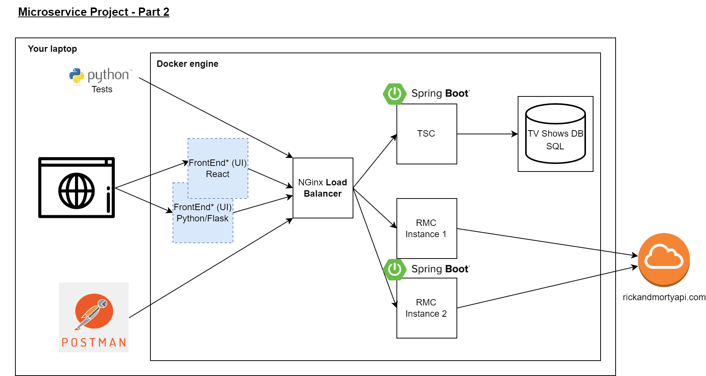
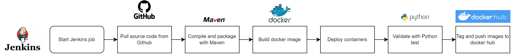

# Second assignment - Microservice: Part 2

## Introduction
During this second part, you will extend the capabilities of your deployment.

# Services improvement
Here is an overview of the improvements that can be done in the second part of this project :

## TV Shows Characters Service - TSC (for Java developers)
Implement the ability to insert data in the DB using hibernate.
- Following the best practice in REST API implementation, implement a way to insert data in the DB. We need to be able to insert new tv shows and add characters to a tv show.

Document your REST API by integrating OpenAPI 3.0 in your Springboot application

Implement logging in your application, you will need to produce a log for each request that will contain information on what was retrieved and if it was successfully fetched or not.

## Rick and Morty Characters Service - RMC (for Java developers)
Deploy a second container Service 1 identical to the first one. Both containers should have the same behavior and simultaneously run. 

Document your REST API by integrating OpenAPI 3.0 in your Springboot application

Implement logging in your application, you will need to produce a log for each request that will contain information on what was retrieved and if it was successfully fetched or not.

## Nginx (for SRE)
Implement a load balancer in nginx to redirect alternatively request to the first and second instances of RMC

## FrontEnd/UI (For blue team: Devaiah / Varshini)
Implement an interface for inserting new records in the DB through the TSC service: adding a tv show, adding character to a tv show.

## Python test
Implement tests in Python language, you can use pytest package to do that. You will implement a test to verify that the service behaves as expected. For example, by inserting a record and checking that this record is returned in the correct format.

## Jenkins (for SRE)
You will set up a Jenkins instance on your laptop. You will create a pipeline that will build, deploy, test and package a service. The goal is to automate the process, once the code is done, the rest must be done automatically up to the upload of the docker image to dockerhub.

# Demo to your respective manager
You will need to do an individual presentation to your respective manager with everything running on your personal laptop. This presentation should include a live demo.
You will need to explain the architecture of your project, how it is deployed, how does service communicate, etc...